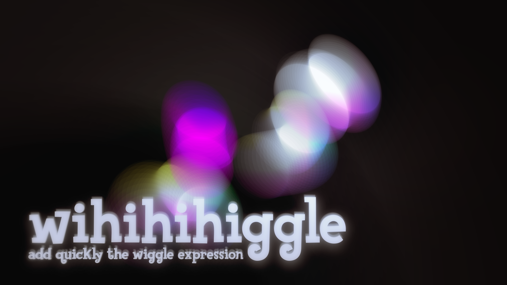
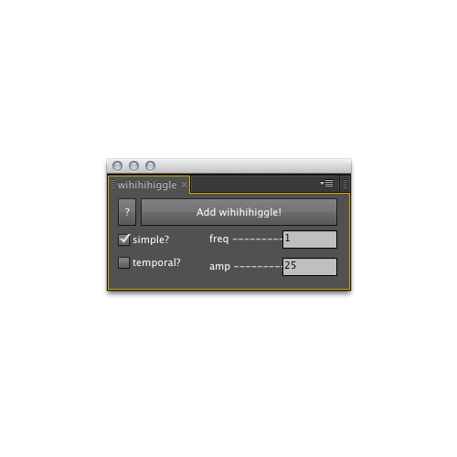
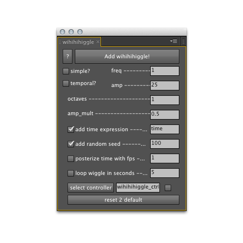

  
#wihihihiggle script for AECS4+ 
#Version 0.1  
---------------------  
##Aren't you tired of writing wiggle again and again and again?
.  
##Do you always use wiggle() with a basic setting like wiggle(0.5,23)?  
.  
##Did you ever wonder what the extended version wiggle(freq, amp, octaves = 1, amp_mult = .5, t = time) does?  
.  
 
  <iframe src="http://player.vimeo.com/video/47651491" width="100%" height="281" frameborder="0" webkitAllowFullScreen mozallowfullscreen allowFullScreen></iframe>
 
 
This Script ist mostly a GUI for that famous wiggle() expression with some extra expression goodness like posterizeTime(framesPerSecond), seedRandom(seed) and the great [looping wiggle() expression](http://www.motionscript.com/design-guide/looping-wiggle.html) by Dan Ebberts. In simple mode it adds the wiggle() expression with the choosen frequence and amplitude to the selected properties. It also saves your standard values for faster access. in the 'not simple' mode it creates a controller Null Object with some sliders and applies the following expression to your selected properties. The advanced mode is more or less for learning the possibilities wiggle offers.  

##The Extended Expression

  


   
 layer = thisComp.layer('wihihihiggle_ctrl'); // <-- THE CONTROL LAYER
 /* ------------------------------- */
 /* -----THE SLIDER CONTROLS------- */
 freq = layer.effect('freq')('ADBE Slider Control-0001');
 amp = layer.effect('amp')('ADBE Slider Control-0001');
 seed = layer.effect('seed')('ADBE Slider Control-0001');
 octaves = layer.effect('octaves')('ADBE Slider Control-0001');
 amp_mult = layer.effect('amp_mult')('ADBE Slider Control-0001');
 t = layer.effect('t')('ADBE Slider Control-0001');
 framesPerSecond = layer.effect('framesPerSecond')('ADBE Slider Control-0001');
 loopTime = layer.effect('loopTime')('ADBE Slider Control-0001');
 /* ------------------------------- */
 seedRandom(seed);
 // posterizeTime(framesPerSecond);
 wiggle(freq,amp,octaves,amp_mult,t)
 // temporalWiggle(freq, amp, octaves, amp_mult, t);
 /* ------------------------------- */
 // Thanx to Dan Ebberst
 // Expressionieer's Designer Guide
 // Loop wiggle()
 // http://www.motionscript.com/design-guide/looping-wiggle.html
 // tLooped = t % loopTime;
 // wiggle1 = wiggle(freq, amp, octaves, amp_mult, tLooped);
 // wiggle2 = wiggle(freq, amp, octaves, amp_mult, tLooped - loopTime);
 // linear(tLooped, 0,  loopTime, wiggle1, wiggle2)
 /* ------------------------------- */
 // created with wihihihiggle script by fabiantheblind
 // checkout --> http://fabiantheblind.info
 
 
 
  

----------
These are some short discriptions on how all the options work.  
  
-----------------------  
  
  

##Usage Simple
These are the options of the simple mode.
###simple
If you uncheck this all the options for e.g. 'octaves', 'randomSeed' get enabled.  

###usetemporal
If checked this will use a temporalWiggle(). This type of wiggle needs keyframes. So dont wonder if nothing happens. The property will wiggle over time.  

###freq
Define the frequence per second. The default is '1'. Accepts also expressions.  

###amp
Define the amplitude per second. The default is '25'. Accepts also expressions.  

-----------------------  

  

##Usage Not Simple  
The following are the options of the extended mode.  

###octaves
Define the octaves for you expression. The default is '1'. The more octaves you have the more skips your property will have. Accepts also expressions.  

[**From Adobe Helpfiles:**](http://help.adobe.com/en_US/aftereffects
/cs/using/WS3878526689cb91655866c1103906
c6dea-7a0ca.html#WS3878526689cb91655866c
1103906c6dea-79f8a) octaves is the number of octaves of noise to add together. This value controls how much detail is in the wiggle. Make this value higher than the default of 1 to include higher frequencies or lower to include amplitude harmonics in the wiggle.  

###amp_mult
Define the amplitude multiplier for the octaves. The default is '0.5'. The higher this value is the more it will amplify your skips. Keep this realy low. Accepts also expressions   
[**From Adobe Helpfiles:**](http://help.adobe.com/en_US/aftereffects
/cs/using/WS3878526689cb91655866c1103906
c6dea-7a0ca.html#WS3878526689cb91655866c
1103906c6dea-79f8a) amp_mult is the amount that amp is multiplied by for each octave. This value controls how fast the harmonics drop off. The default is 0.5; make it closer to 1 to have the harmonics added at the same amplitude as the base frequency, or closer to 0 to add in less detail.  

###addTime
If checked the script will add a 'time' expression on that slider. If not it just uses a value. You can use a value and than keyframe the slider. This enables you to run time backward or stretch it for the wiggle.  

###t
Define the time value. This is just a fallback. If the time does not proceed there will be no wiggle. Use the slider to keyframe the time by yourself or add an expression like 'time' .The default is '1'.  

###addseed
If checked this will add the 'seedRandom(value)' expression. This is usefull if you need to have the same behaviour on several wiggle expression but you dont want to parent the layers.  

###seed
Define the random seed for your expression. All the expression with the same random seed will have a similar behaviour. The default is '100'. Accepts also expressions.  

###addpstrz
If checked the 'posterizeTime()' expression will be added. This allows to stop the time off the expression for the given amount of frames. If added the 'add time expression' will be disabled.  

###framesPerSecond
Define the a fps value for the time posterize. It is like stopping the time and wating for the given number of frames. The default is '1'. Accepts also expressions.  

###addLoop
If checked the loop wiggle expression by Dan Ebberts gets enabled. It allows to create a looping wiggle.  

###loopTime
Define the looptime in seconds. This is based on Dan Ebberts great [loop wiggle expression](http://www.motionscript.com/design-guide/looping-wiggle.html). The default is '5'. Accepts also expressions.  

###button_select_ctrl
Hit this button and the selected layer will be used as the controller. BEWARE all the Sliders need to be there. If they are not your expression will throw an error.  

###controller Name Textfield
Enter a name for your controller. This will be used in the expression and as the name of the 'Null Layer'.  

###ctrlExists
This box checks itself by hitting the Select Control button. If it is checked the Script will asume you have a controller with the name set in the textfield to the left. If you uncheck it the script will create a new controler by that given name  

###Run Button
Press me and i will apply your expression to the selected properties  

###Reset Button
This will reset all fields to their default values. Also the saved values will be reseted.  

###Help Button
Press me and i will try to help you. You also should watch the tutorials on this script on: http://fabiantheblind.info  

---------------------  
##Download  
You can download the script <a href="https://github.com/downloads/fabiantheblind/wihihihiggle/wihihihiggle_script_v01.zip" onClick="_gaq.push(['_trackEvent', ‘Download', 'script', 'wihihihiggleScript', 1, false])" target="blanc"> here.</a>    
  
---------------------  
##Contribute  
I'm happy about every idea, wishes, bug reports, pull requests or praises on this script. All of them will keep me developing and making it better.  

---------------------  
##Comments  

  

<noscript>Please enable JavaScript to view the <a href="http://disqus.com/?ref_noscript">comments powered by Disqus.</a>
</noscript>
<a href="http://disqus.com" class="dsq-brlink">comments powered by Disqus</a>
        

---------------------  
##Praises  
Thanx to Dan Ebberts for his great [motionscript.com](http://motionscript.com) and all the others who share things open source on the web.  

---------------------  
##Donate
If you want to donate something use the paypal or flattr button below or go over to [aescripts.com](http://aescripts.com/authors/e-l/fabiantheblind/) and purchase one of my other scripts* there.  

  
   
######*actually it's only [one](http://aescripts.com/aemap/) ;). But I'm working on it.   

---------------------  

##License
Copyright (c)  2012 Fabian "fabiantheblind" Morón Zirfas  
Permission is hereby granted, free of charge, to any person obtaining a copy of this software and associated documentation files (the "Software"), to deal in the Software  without restriction, including without limitation the rights to use, copy, modify, merge, publish, distribute, sublicense, and/or sell copies of the Software, and to  permit persons to whom the Software is furnished to do so, subject to the following conditions:  
The above copyright notice and this permission notice shall be included in all copies or substantial portions of the Software.  
THE SOFTWARE IS PROVIDED "AS IS", WITHOUT WARRANTY OF ANY KIND, EXPRESS OR IMPLIED, INCLUDING BUT NOT LIMITED TO THE WARRANTIES OF MERCHANTABILITY, FITNESS FOR A  PARTICULAR PURPOSE AND NONINFRINGEMENT. IN NO EVENT SHALL THE AUTHORS OR COPYRIGHT HOLDERS BE LIABLE FOR ANY CLAIM, DAMAGES OR OTHER LIABILITY, WHETHER IN AN ACTION OF  CONTRACT, TORT OR OTHERWISE, ARISING FROM, OUT OF OR IN CONNECTION WITH THE SOFTWARE OR THE USE OR OTHER DEALINGS IN THE SOFTWARE.  

